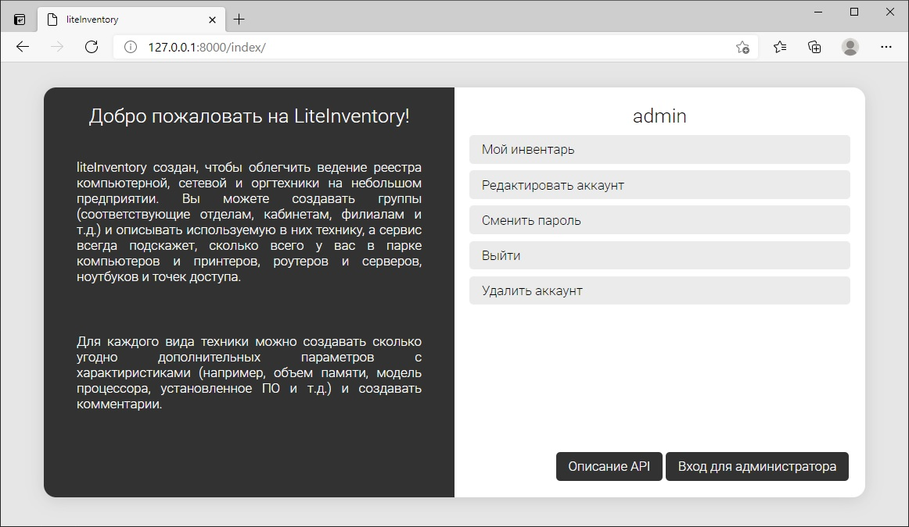
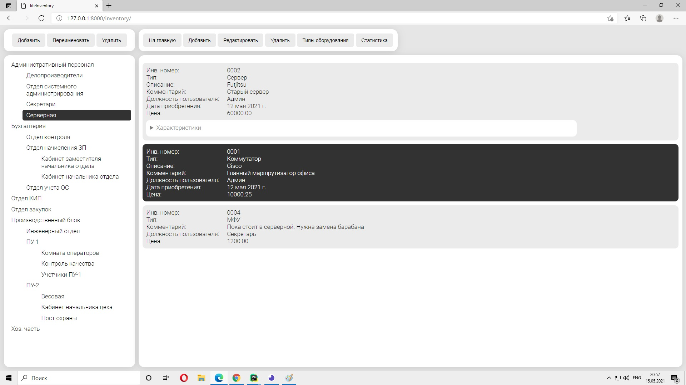
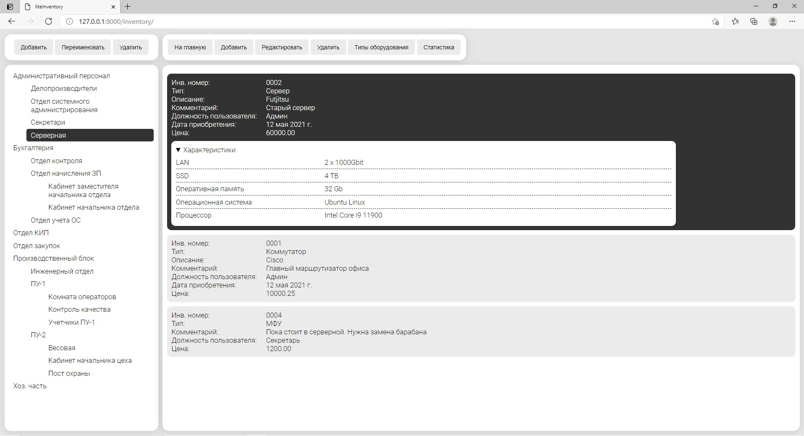
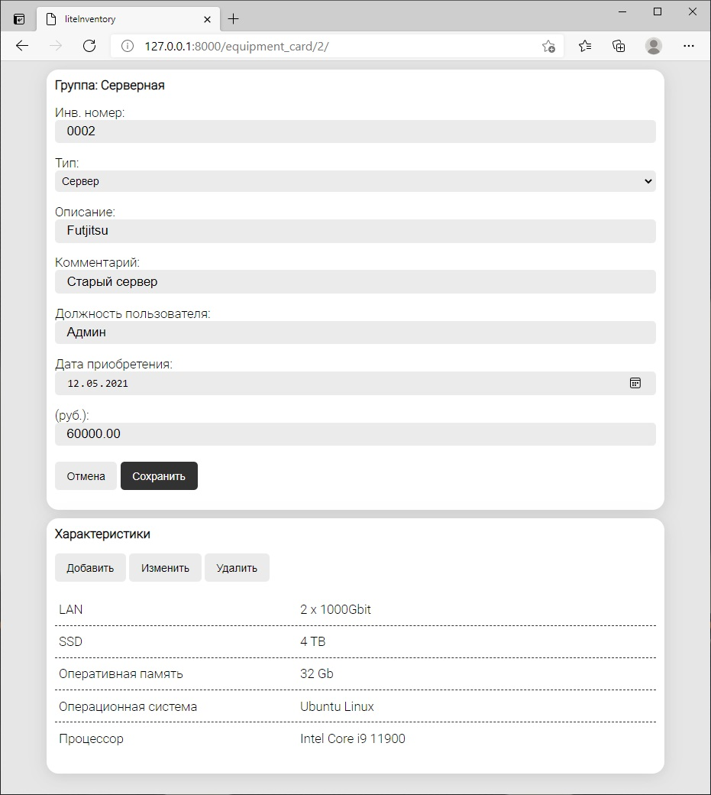
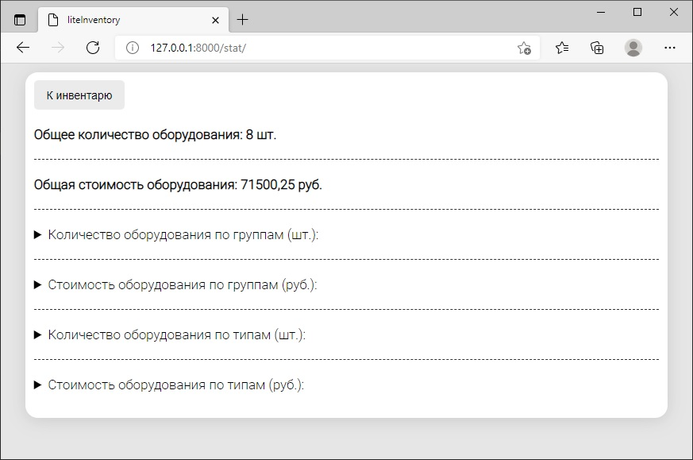
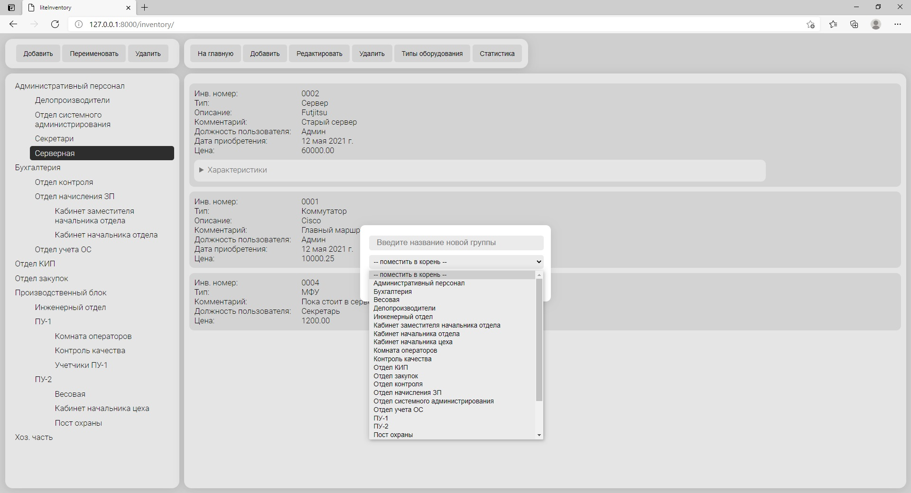
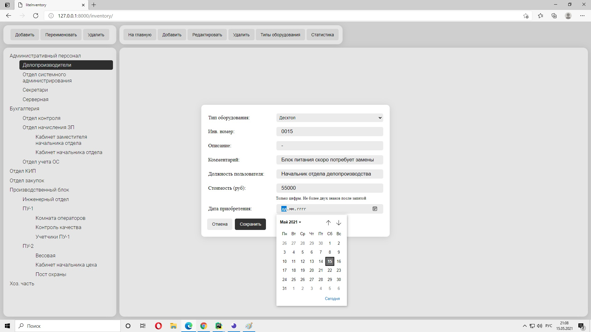
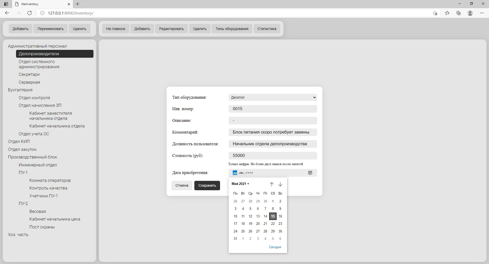

# LiteInventory

Есть задача, к которой я периодически возвращаюсь, решая её каждый раз на новом уровне и немного не так как раньше, добавляя что-то новое. Суть задачи проста: во многих приложениях есть необходимость хранения и работы с иерархической структурой данных. Как обычно, это какой-то справочник. Справочник товаров (разбитых на категори), справочник работников организации (распределенных по отделам) и т.д. Необходимо организовать работу пользователей с этим справочником: добавлять и удалять группы и элементы, выводить статистику (например, по группам).

Сперва я пробовал [решить эту задачу](https://github.com/SergeyLebidko/CatalogComponent) на Java. Тогда я использовал библиотеку Swing, уже давно утратившую актуальность.
Затем, когда я приступил к изучению Django я [снова обратился к этой задаче](https://github.com/SergeyLebidko/WebCatalog). Но на тот момент я был абсолютно не знаком с JavaScript и не мог создать более-менее адекватно выглядящий интерфейс, всё было очень примитивно и не функционально.

Сейчас, когда я намного более уверенно ориентируюсь во фронтенд-технологиях, я опять попробовал сделать такой справочник, но на этот раз в виде небольшого (но функционально законченного) сервиса по ведению учета компьютерной техники. Когда я работал админом, то вел учет в таблице Excel, теперь же я представил, каким бы мог быть сервис для этого.

Я продумал схему базы данных, набор страниц для работы, создал API для интеграции (добавил даже отдельную страницу с описанием хуков) и написал простую фронт-часть на шаблонах Django и jQuery. Мне хотелось, чтобы сервис внешне выглядел аскетично, но аккуратно, поэтому я выбрал черно-белый стиль. Как будто это что-то похожее на записи в журнале и страницы газеты.

Также я сделал страницы для регистрации аккаунта, входа в аккаунт, его редактирования и сброса пароля, и API для всех этих операций. Для сброса пароля я реализовал процедуру отправки пользователю email с кодом сброса. Для этого я специально зарегистрировал почтовый ящик для сервиса:

liteinventory@gmail.com

Пароль от ящика: gThk8%lo@ji86&

Набор таблиц базы данных прост:
- Token - хранит данные о токенах пользователя, необходимых для авторизации в API. От предлагаемой в Django Rest Framework схемы аутентификации на основе токенов моя отличается тем, что позволяет хранить несколько токенов, привязанных к одному пользователю (для авторизации на разных устройствах).
- ResetPasswordCode - харинит коды, отправляемые пользователям для сброса пароля.
- Group - группы оборудования (может хранить, например, названия отделов, в которых стоит оборудование или номера кабинетов и т.п.).
- EquipmentCard - карточка оборудования (хранит название, стоимость, инвентарный номер и т.д.; большая часть этих данных, тем не менее, не обязательна к заполнению, за исключением типа оборудования)
- EquipmentFeature - свойство или характеристика оборудования. Для компьютеров, например, в этой таблице можно хранить модель процессора или объем RAM, для принтера - скорость печати и модель картриджей и т.д.
- EquipmentType - тип оборудования. При регистрации нового пользователя в эту таблицу для него добавляются следующие типы: Десктоп, Ноутбук, Сервер, Принтер, МФУ, Сканер, Коммутатор, Роутер. В дальнейшем пользователь может изменить этот список под свои нужды добавляя, удаляя и переименовывая типы.

Имя пользователя в БД: admin. Пароль: admin.

Для запуска проекта необходимо выполнить клонирование репозитория в отдельную папку (git clone), затем установить зависимости командой
```pip install -r requirements.txt``` и, наконец, стартовать тестовый сервер ```python manage.py runserver```
















