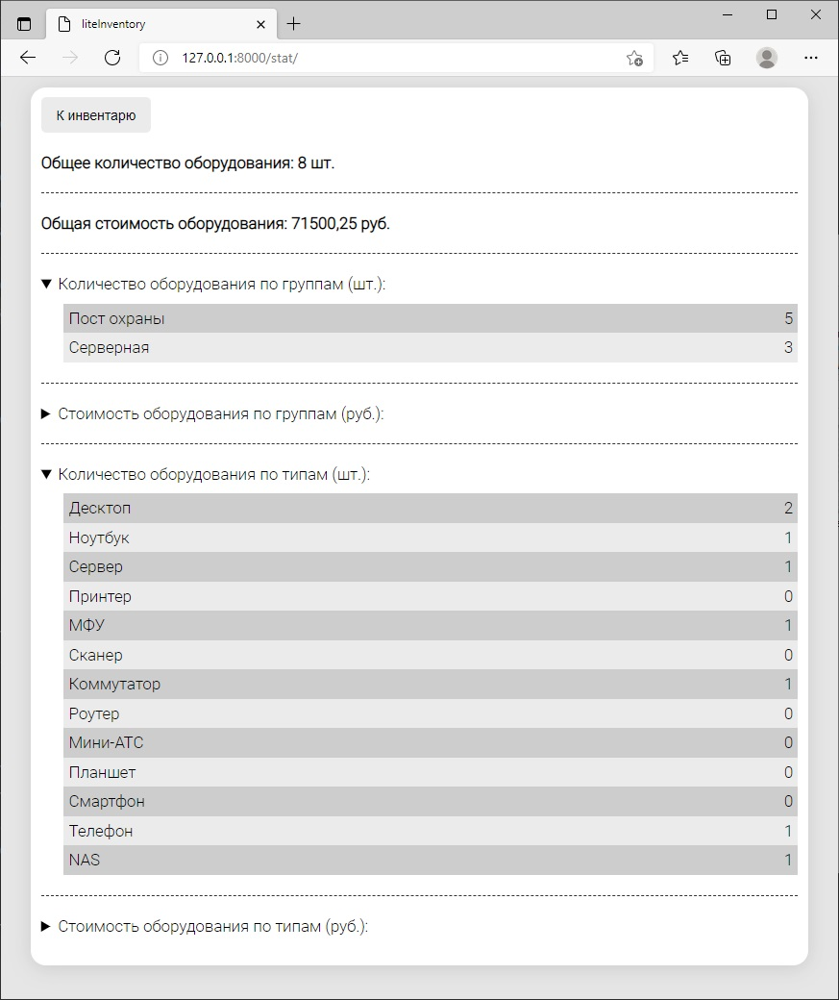

# LiteInventory

Есть задача, к которой я периодически возвращаюсь, решая её каждый раз на новом уровне и немного не так как раньше, добавляя что-то новое. Суть задачи проста: во многих приложениях есть необходимость хранения и работы с иерархической структурой данных. Как обычно, это какой-то справочник. Справочник товаров (разбитых на категори), справочник работников организации (распределенных по отделам) и т.д. Необходимо организовать работу пользователей с этим справочником: добавлять и удалять группы и элементы, выводить статистику (например, по группам).

Сперва я пробовал [решить эту задачу](https://github.com/SergeyLebidko/CatalogComponent) на Java. Тогда я использовал библиотеку Swing, уже давно утратившую актуальность.
Затем, когда я приступил к изучению Django я [снова обратился к этой задаче](https://github.com/SergeyLebidko/WebCatalog). Но на тот момент я был абсолютно не знаком с JavaScript и не мог создать более-менее адекватно выглядящий интерфейс, всё было очень примитивно и не функционально.

Сейчас, когда я намного более уверенно ориентируюсь во фронтенд-технологиях, я опять попробовал сделать такой справочник, но на этот раз в виде небольшого (но функционально законченного) сервиса по ведению учета техники. Когда я работал админом, то вел учет в таблице Excel, теперь же я представил, каким бы мог быть сервис для этого.

Я продумал схему базы данных, набор страниц для работы, создал API для интеграции (добавил даже отдельную страницу с описанием хуков) и написал простую фронт-часть на шаблонах Django и jQuery. Мне хотелось, чтобы сервис внешне выглядел аскетично, но аккуратно, поэтому я выбрал черно-белый стиль. Как будто это что-то похожее на записи в журнале и страницы газеты.

Также я сделал страницы для регистрации аккаунта, входа в аккаунт, его редактирования и сброса пароля, и API для всех этих операций. Для сброса пароля я реализовал процедуру отправки пользователю email с кодом сброса. Для этого я специально зарегистрировал почтовый ящик для сервиса:

liteinventory@gmail.com

gThk8%lo@ji86&

Имя пользователя в БД: admin. Пароль: admin.

